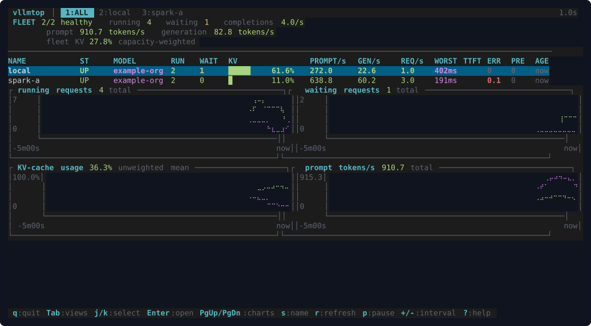
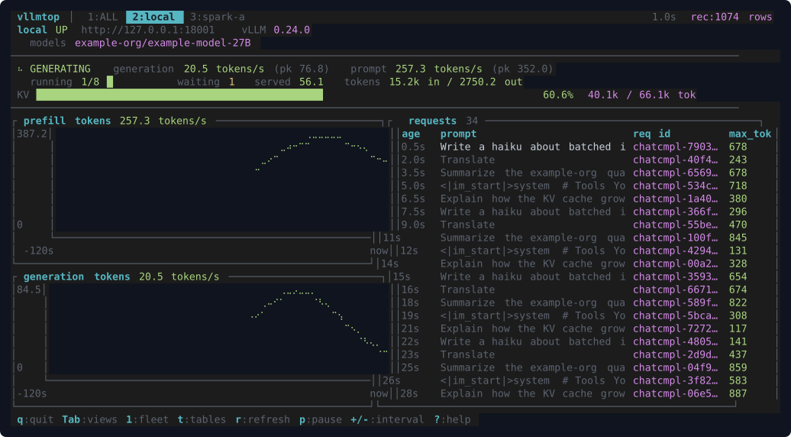
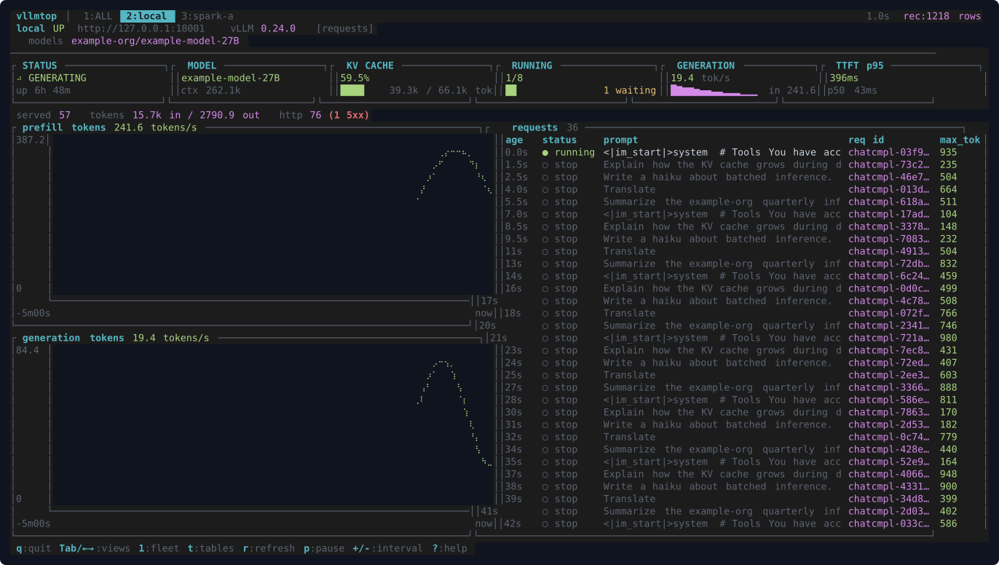

# vllmtop

`vllmtop` is a terminal dashboard for [vLLM](https://docs.vllm.ai/) servers.
Point it at one server or a whole fleet and it shows you, live, what each one
is doing: which models are loaded, how many requests are running and waiting,
prompt and generation token rates, latency percentiles, and how full the
KV cache is. In the fleet view you also get a per-endpoint table, a
past-30-days usage chart, and rolling history.

It is for the moments when you want to glance at a box (or twelve) and know
whether the server is healthy, busy, idle, or about to fall over — without
setting up Prometheus and Grafana, and without touching the server. vllmtop
only ever sends GET requests to endpoints vLLM already exposes.

**Fleet overview** — endpoint table, past-30-days usage, rolling history:



**Endpoint detail** — status cards over live charts for throughput, queue
depth, KV cache and latency, with percentiles, server/model facts and the
live request log below:



Press `t` to cycle the lower half: **requests** puts the live request log
beside the token rates, **tables** brings up the latency percentiles.



*(Screenshots captured against local mock vLLM servers.)*

## Quick start

There are no binary releases yet, so you build from source. You need a
stable Rust toolchain (1.88 or newer) from <https://rustup.rs>; nothing
else — SQLite is bundled and TLS uses rustls, so no system OpenSSL.

```bash
git clone https://github.com/yongzane00/vllmtop && cd vllmtop
cargo build --release
./target/release/vllmtop            # monitors http://127.0.0.1:8000
```

`cargo install --path .` works too if you want the binary on your `PATH`.
Press `?` inside the app for the key list, `q` to quit.

Binary releases (static musl builds for x86_64 and aarch64) and a crates.io
package are planned. If either would help you, an issue or pull request is
welcome.

## Watching more than one server

Give each server a name and a URL with `-e`. Add `@N` to tell vllmtop the
server's `--max-num-seqs`, which vLLM does not export; that is what turns
the "running" count into an n/max utilization bar.

```bash
vllmtop -e local=http://127.0.0.1:8000 \
        -e spark-a=https://10.0.0.21:8443@8 \
        -e https://10.0.0.22:8443            # unnamed: shows as 10.0.0.22:8443
```

The fleet view lists every endpoint with its model, running/waiting
requests, token rates, and KV-cache utilization. `s` cycles the sort
column, `j`/`k` (or the arrow keys) move the selection, `Enter` opens the
endpoint's detail view, and `Tab` or the number keys switch between them.

Fleet-wide KV-cache utilization is weighted by each server's cache capacity
when every endpoint reports it. When one doesn't, vllmtop falls back to a
plain mean and marks the figure with `~` so you know it is not comparable.

## Configuration

For anything beyond a couple of endpoints, use a config file at
`~/.config/vllmtop/config.toml` (or pass `--config PATH`). The annotated
example in [examples/config.toml](examples/config.toml) covers every field.
Precedence is defaults < file < command-line flags, and `-e` on the command
line replaces the file's whole endpoint list rather than adding to it.

```toml
refresh_interval_ms = 1000
history_seconds = 300

[[endpoints]]
name = "local"
url  = "http://127.0.0.1:8000"
log_file = "/var/log/vllm/server.log"     # enables the requests pane

[[endpoints]]
name = "spark-a"
url  = "https://10.0.0.21:8443"
bearer_token_env = "SPARK_A_VLLM_TOKEN"   # name of the variable, not the token
max_running = 8                           # server's --max-num-seqs
```

Secrets never live in the file. Fields ending in `_env` name environment
variables whose values are read at startup and used only inside the HTTP
client — they are never logged, displayed, or recorded. If a named variable
is unset, only that endpoint is disabled (with a clear error) and the rest
keep working. Extra headers work the same way via `[endpoints.header_env]`.

Useful flags:

```bash
vllmtop --refresh-interval-ms 2000             # poll every 2 s (1000..60000)
vllmtop --history-seconds 900                  # keep 15 min of chart history in memory
vllmtop --percentile-window-seconds 120        # longer window for latency percentiles
vllmtop --no-record                            # don't write usage.db (see below)
vllmtop --record /var/lib/vllmtop/usage.db     # record somewhere else
vllmtop --no-color                             # monochrome ASCII theme (NO_COLOR also works)
vllmtop --completions bash                     # shell completions to stdout
```

### Usage recording

The past-30-days charts in the fleet view need more history than fits in
memory, so vllmtop records aggregate metric samples to a small SQLite
database — by default `~/.local/share/vllmtop/usage.db` (or under
`$XDG_DATA_HOME`), with 30-day retention (`--retention-days`). Only
aggregate counters are stored: never prompts, tokens, headers, or request
contents. `--no-record` turns recording off, which also blanks the
daily-usage charts because there is nothing to compute them from. A `--`
bar in those charts means vllmtop was not watching that day, not that usage
was zero. The arithmetic is described in
[docs/USAGE-ACCOUNTING.md](docs/USAGE-ACCOUNTING.md).

## How the numbers are computed

vLLM's metrics have a few traps, and vllmtop tries not to paper over them:

- **Rates survive restarts.** Token and request rates come from cumulative
  counters, which reset when the server restarts. vllmtop detects the reset,
  shows a `RESTARTED` badge, and never displays a negative rate or a
  spurious spike.
- **Missing means `--`, not `0`.** If an endpoint does not expose a metric
  (older vLLM, different backend, feature disabled), the cell shows `--`.
  Zero is only ever shown when the server actually reported zero.
- **Stale endpoints say so.** When polls fail or time out, the endpoint is
  marked `STALE` and its last values stay visible but flagged, rather than
  silently freezing or dropping to zero.
- **Percentiles are estimates.** vLLM exports latency histograms, not
  percentiles. The p50/p90/p99 figures are interpolated from bucket deltas
  over a rolling window (`--percentile-window-seconds`, default 60 s) and are
  labelled as estimates.
- **In-memory history is bounded.** Charts keep up to 4096 points per
  series — about 68 minutes at the default 1 s refresh. Longer views come
  from the recorded database, not from memory.

vllmtop works purely at the metrics layer, so it is accelerator-agnostic:
NVIDIA, AMD, Intel, CPU, or any other vLLM backend look the same to it. It
does not call `nvidia-smi`, NVML, or any vendor library.

## Requests pane

vLLM's HTTP API exposes nothing about individual requests, so the requests
pane in the endpoint view (age, prompt preview, request id, `max_tokens`)
works differently from everything else: it tails the server's own stdout
log. This is opt-in per endpoint via `log_file`, and it reads local files
only — the log has to be readable from the machine running vllmtop, either
the same host or a mounted path. Remote endpoints without a log show a hint
instead.

The server needs `--enable-log-requests` for the pane to show anything, and
prompt previews additionally need `VLLM_LOGGING_LEVEL=DEBUG`; at INFO you
still get request id, age, and `max_tokens`. Previews are bounded in length
and held in a small in-memory ring — they are never recorded to disk or
written anywhere. Log formats, parsing details, and the exact bounds are in
[docs/LOG-TAILING.md](docs/LOG-TAILING.md).

## Keys

| Key | Action |
| --- | --- |
| `q` / `Ctrl+C` | quit |
| `Tab` / `Shift+Tab`, `←`/`→`, `1`…`9` | switch views (`1` is the fleet overview) |
| `j`/`k` or `↑`/`↓`, `Enter` | select / open endpoint (fleet view) |
| `g` / `G` | jump to first / last row |
| `PgUp`/`PgDn`, mouse wheel | scroll the history charts |
| `s` | cycle fleet sort column |
| `t` | endpoint view: cycle overview / requests / tables |
| `r` | force refresh |
| `p` | pause display (collection continues) |
| `+` / `-` | faster / slower refresh |
| `?` | help (`Esc` closes it) |

## Compatibility

vLLM ≥ 0.8 metric names (the V1 engine) are the primary target, with an
alias table for older spellings. Unrecognized metrics are parsed and skipped
without breaking anything, and renamed ones map through the alias table.
The exact list of metrics vllmtop reads, their aliases, and what happens
when each is missing is in [docs/METRICS.md](docs/METRICS.md).

If your vLLM version or backend shows `--` where you expect a number, an
issue with the vLLM version, hardware backend, engine flags, and a sanitized
copy of `curl http://HOST:PORT/metrics` is usually enough to add an alias or
fixture quickly.

vllmtop is a single static Linux binary with no runtime dependencies: no
Python, Docker, Prometheus, Grafana, or system OpenSSL. It works on
256-color and truecolor terminals; `NO_COLOR` or `--no-color` gives a
monochrome ASCII theme. The layout is tuned for roughly 120×30 and degrades
gracefully in smaller terminals.

## Scope

vllmtop is a read-only observer. It polls `/metrics` (and, when available,
`/health`, `/version`, and `/v1/models`) with GET requests. It never proxies,
inspects, or modifies inference traffic, and it has no way to control the
server. It sends no telemetry of its own.

Things it deliberately does not do:

- per-user or per-conversation attribution (vLLM's metrics do not carry it)
- host hardware monitoring (GPU temperature, power, memory — use your
  vendor's tool alongside)
- alerts, webhooks, or notifications
- a web UI or OpenTelemetry export
- starting, stopping, or reconfiguring servers

Per-request visibility exists only through the local, opt-in
[requests pane](#requests-pane).

## Development

Run it straight from the source tree while you work on it. Flags for
vllmtop go after `--`, so cargo doesn't try to interpret them:

```bash
cargo run                                     # debug build, monitors 127.0.0.1:8000
cargo run -- -e local=http://127.0.0.1:8000   # pass flags after --
cargo run -- --no-record --no-color           # skip the usage database, plain theme
cargo run --release -- --refresh-interval-ms 2000
```

A debug build is fine for the TUI, though `--release` renders noticeably
more smoothly on large fleets.

Before sending a change, all four of these must pass; CI enforces them:

```bash
cargo fmt --all -- --check
cargo clippy --all-targets --all-features -- -D warnings
cargo test --all-features
cargo build --release
```

See [CONTRIBUTING.md](CONTRIBUTING.md) for setup and conventions, and the
[documentation index](docs/README.md) for architecture, metric semantics,
and design notes under `docs/`.

## License

Licensed under either of

- Apache License, Version 2.0 ([LICENSE-APACHE](LICENSE-APACHE))
- MIT license ([LICENSE-MIT](LICENSE-MIT))

at your option.

Unless you explicitly state otherwise, any contribution intentionally
submitted for inclusion in the work by you, as defined in the Apache-2.0
license, shall be dual licensed as above, without any additional terms or
conditions.
